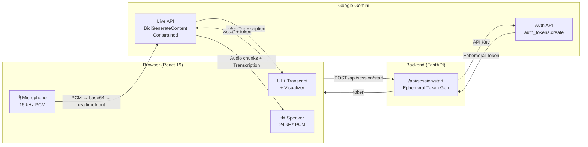

<div align="center">

# ◆ AI System Design Interviewer

**Practice system design interviews with an adaptive AI interviewer — real-time voice conversations powered by Gemini Live API over raw WebSockets.**


</div>

---

## 📸 Demo

> **Note:** This app runs locally. Clone the repo and follow the [Getting Started](#-getting-started) instructions below.


---

## ✨ Features

- 🎙️ **Real-Time Voice Streaming** — Talk naturally with the AI interviewer using full-duplex audio over WebSockets
- 🧠 **Adaptive Questioning** — AI adjusts difficulty and follow-ups based on your responses, mimicking a senior staff engineer
- 📊 **Interview Phase Tracking** — Visual progress bar guides you through Requirements → HLD → Deep Dive → Scaling → Trade-offs
- 🔊 **Live Audio Visualizer** — Animated frequency bars react to your microphone input in real time
- 💬 **Live Transcription** — Both your speech and AI responses are transcribed on-screen as the conversation flows
- 🎨 **Premium Glassmorphism UI** — Dark theme with animated gradient orbs, frosted-glass panels, and smooth micro-animations
- 🔐 **Ephemeral Token Auth** — API keys never touch the browser; short-lived tokens are generated server-side

---

## 🛠️ Tech Stack

| Layer | Technology | Why |
|-------|-----------|-----|
| **Frontend** | React 19 + Vite 8 | Component-driven UI with HMR for rapid development |
| **Styling** | Vanilla CSS | Full control over glassmorphism effects, keyframe animations, and responsive grid — no framework overhead |
| **Audio Capture** | Web Audio API (ScriptProcessor) | Raw PCM capture at 16 kHz with real-time float→int16→base64 encoding |
| **Audio Playback** | Web Audio API (AudioBuffer) | Queued PCM playback at 24 kHz with gapless scheduling |
| **Backend** | FastAPI (Python) | Async-native, fast token generation endpoint with Pydantic validation |
| **AI Engine** | Gemini Live API (`gemini-3.1-flash-live-preview`) | Multimodal real-time streaming via `BidiGenerateContentConstrained` WebSocket protocol |
| **Auth** | Google GenAI Ephemeral Tokens | Time-limited, single-use tokens with model + config constraints baked in |

---

## 🏗️ Architecture



### Data Flow

1. **User clicks Start** → Frontend `POST`s to `/api/session/start`
2. **Backend generates ephemeral token** → FastAPI uses the Gemini Auth API with a locked model config (system instruction, temperature, modality)
3. **Frontend opens WebSocket** → Connects directly to `wss://generativelanguage.googleapis.com/ws/...BidiGenerateContentConstrained` with the ephemeral token
4. **Microphone captures audio** → `ScriptProcessor` captures 16 kHz mono PCM, converts float32 → int16 → base64, sends as `realtimeInput` JSON frames
5. **Gemini responds** → Returns audio chunks (base64 PCM at 24 kHz) + text transcription over the same WebSocket
6. **Frontend plays audio** → Decodes base64 → int16 → float32, creates `AudioBuffer` at 24 kHz, queues playback with gapless scheduling

---

## 🚀 Getting Started

### Prerequisites

- **Node.js** v18+ — [Download](https://nodejs.org/)
- **Python** 3.10+ — [Download](https://python.org/)
- **Google Gemini API Key** — [Get one here](https://aistudio.google.com/apikey)

### Backend Setup

```bash
# Navigate to the backend directory
cd backend

# Create a .env file with your API key
echo "GEMINI_API_KEY=your_api_key_here" > .env

# Create and activate a virtual environment
python -m venv venv
source venv/bin/activate        # Linux / macOS
# venv\Scripts\activate         # Windows

# Install dependencies
pip install fastapi uvicorn python-dotenv google-genai

# Start the backend server
python main.py
```

The backend will be running at `http://localhost:8000`.

### Frontend Setup

```bash
# Navigate to the frontend directory
cd frontend

# Install dependencies
npm install

# Start the dev server
npm run dev
```

The frontend will be running at `http://localhost:5173`.

### Environment Variables

| Variable | Location | Description |
|----------|----------|-------------|
| `GEMINI_API_KEY` | `backend/.env` | Your Google Gemini API key |

---

## 📖 Usage

1. **Select a topic** — Choose from 8 system design problems (URL Shortener, Chat System, News Feed, etc.) or pick Custom
2. **Click Start Interview** — The app requests mic access, generates an ephemeral token, and connects to Gemini
3. **Speak naturally** — The AI interviewer greets you and guides through all interview phases
4. **Follow the phase bar** — Track your progress: Requirements → HLD → Deep Dive → Scaling → Trade-offs
5. **Review the transcript** — Both sides of the conversation are transcribed in real time
6. **End Interview** — Click "End Interview" to close the session

---

## 🧠 Skills Demonstrated

Building this project required working across the full stack with real-time constraints:

- **WebSocket Protocol Engineering** — Implemented Google's `BidiGenerateContentConstrained` binary protocol from scratch using raw WebSockets, handling setup handshakes, bidirectional audio frames, transcription events, turn completion, and interruption signals — no SDK wrapper
- **Real-Time Audio Processing** — Built a complete audio pipeline: mic capture at 16 kHz → float32-to-int16 PCM encoding → base64 serialization → WebSocket transmission, and the reverse path at 24 kHz with gapless queued playback via `AudioBuffer`
- **Full-Stack Architecture** — Designed a clean separation: React handles the UI and WebSocket connection, FastAPI handles secure token generation, Gemini handles the AI — each layer does one thing well
- **API Security Design** — Implemented ephemeral token authentication so the API key never leaves the server; tokens are time-limited (30 min), single-use, and locked to a specific model configuration
- **Modern CSS & UI Engineering** — Built a premium glassmorphism dark theme from scratch with animated gradient orbs, frosted-glass cards, real-time frequency visualizer bars, and smooth state transitions — no UI library
- **AI/LLM Integration** — Crafted a system prompt that drives a structured 5-phase interview, with the AI adapting its questioning depth based on candidate responses

---

## 🗺️ Roadmap

- [ ] Post-interview evaluation scorecard with per-category scoring
- [ ] Session history with localStorage persistence and progress tracking
- [ ] Company persona selection (Google, Meta, Amazon interview styles)
- [ ] Difficulty levels (Intern, SDE-1, SDE-2, Senior)
- [ ] Text mode as an alternative to voice
- [ ] Whiteboard / diagram drawing support

---

## 🤝 Contributing

Contributions are welcome! Please open an issue first to discuss what you'd like to change. To contribute: fork the repo, create a feature branch, commit your changes, and open a pull request.

---

## 📄 License

This project is licensed under the [MIT License](LICENSE).

---

<div align="center">

⭐ *If you found this project interesting, consider giving it a star!*

</div>
